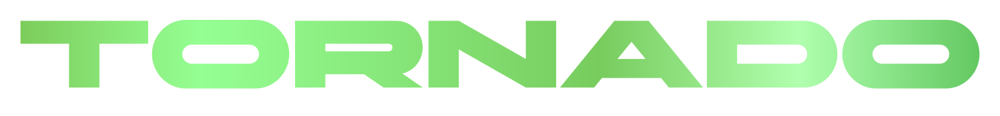

<p align="center">
  <a href="http://89.111.168.223:3000/">
    
</a>
  <a href="http://89.111.168.223:3000/" title="Перейти на сайт">
    
  </a>
</p>

---

<h3 style="display: flex; align-items: center; justify-content: center; gap: 8px;">
  Узнайте больше о проекте
</h3>
<p align="center">
  <a href="for_rdm/TODO.md"></a>
  <a href="for_rdm/SCHEME.md"></a>
  <a href="for_rdm/MODULES.md"></a>
  <a href="for_rdm/BIZ.md"></a>
  <a href="https://pypi.org/project/tornbot/0.1.0/"></a>
  <a href="https://github.com/SayGGGo/Tornado/actions"></a>
  <a href="https://github.com/SayGGGo/Tornado/tree/149f881d0fce1777e9d3135e98fd1369636a6d32"></a>
</p>

---

<h2 style="display: flex;justify-content: left; gap: 8px;">
    
</h2>

— это защищенная коммуникационная платформа, разработанная в рамках модели **B2G** (Business-to-Government). Система ориентирована на создание единого цифрового пространства для образовательных центров, ВУЗов и предприятий, обеспечивая безопасный обмен данными и интеграцию с внешними сервисами.

---
## Содержание
1. [Основные возможности](#основные-возможности)
2. [Стек проджекта](#стек-проджекта)
3. [Структура проджекта](#структура-проджекта)
4. [Безопасность](#безопасность)
5. [Установка и запуск](#установка-и-запуск)
6. [Тесты и автоматический деплой](#тесты-и-автоматический-деплой)
7. [F.A.Q](#faq)

## Основные возможности
* **Защищенное соединение**: Полная безопасность ваших сообщений
* **Парсинг**: Демонстрация парсинга на примере групп
* **Bot API и TornBot**: Перенос бота из Telegram в Tornado в пару кликов
* **Liquid Glass**: Современный эффект, придающий проекту уникальности 
* **Безопастность**: От хэшей до капчи

## Стек проджекта
* **Ядро**: Python 3.12 (поддержка 3.10 - 3.14)
* **Веб-фреймворк**: Flask
* **База данных**: SQLAlchemy
* **API и парсинг**: Telethon, Requests, BeautifulSoup4 и другие

## Структура проджекта
| Модуль             | Описание                                                                |
|:-------------------|:------------------------------------------------------------------------|
| **`app.py`**       | Основной файл приложения, обработка маршрутов и бизнес-логики.          |
| **`botapi/`**      | Реализация эндпоинтов и хендлеров для работы ботов.                     |
| **`config/`**      | Настройки приложения, логгирования и переменных окружения.              |
| **`static/`**      | Статические ресурсы: CSS (стили чата), JS (логика интерфейса) и иконки. |
| **`templates/`**   | HTML-шаблоны Jinja2 для всех страниц системы.                           |
| Доп. папки и файлы | Всё, от дополнительных модулей, до .MD файлов.                          |


## Безопасность
* **Защита от XSS**: Экранирование всех сообщений пользователей.
* **Верификация сервера**: Использование лицензионных ключей на основе хэширования SHA256 для доступа к доп. функционалу и получения галочки.
* **Защита от спама**: Интеграция капчи от CloudFlare.
* **Хэширование паролей**: Хэширование паролей через SHA-256.

## Установка и запуск
1. Скопируйте репозиторий проекта.
```bash
git clone https://github.com/SayGGGo/Tornado.git
cd Tornado
```
2. Создайте виртуальное окружение и установите зависимости:
```bash
pip install -r requirements.txt
```
3. Настройте переменные окружения в `.env`:
```env
SECRET_KEY=
DATABASE_URL=sqlite:///tornado.db
TURNSTILE_SITEKEY=
TURNSTILE_SECRET=
```
4. Запустите сервер:
```bash
python app.py
```

## Тесты и автоматический деплой
Проект включает в себя настроенные рабочие процессы GitHub Actions для автоматизации переносов и запуска

## FAQ
**1. Как реализован Liquid Glass?**
Интерфейс использует кастомный SVG-фильтр `liquid-glass-filter` с использованием узлов `feTurbulence` и `feDisplacementMap`, что позволяет создавать эффект динамического искажения стекла. Такое можно просто реализовать на [tonky-kot.ru](https://tonky-kot.ru/cool-stuff/liquid-glass-generator).

**2. Работают ли боты при входе через Telegram?**
Да, но только если бот работает через команды. Клавиатуры и мини-приложения не поддерживаются.

**3. Проект подойдет под любую сферу?**
Да, наш проект можно использовать почти где угодно!

# Спасибо, за то что вы с нами! 
