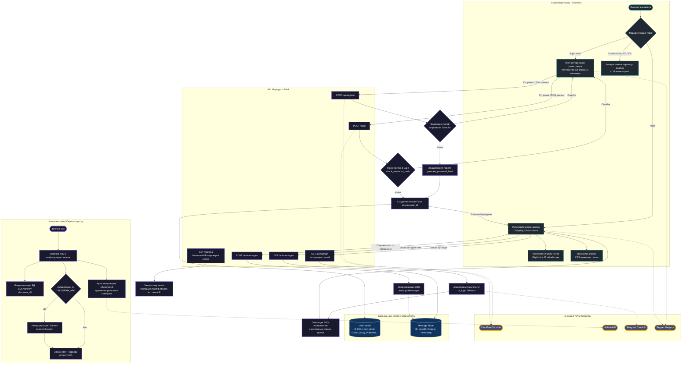

  

```mermaid
graph TD
    classDef server fill:#1a1a2e,stroke:#8774e1,stroke-width:2px,color:#fff;
    classDef client fill:#16213e,stroke:#34c759,stroke-width:2px,color:#fff;
    classDef db fill:#0f3460,stroke:#fff,stroke-width:1px,color:#fff;
    classDef external fill:#4a4e69,stroke:#ffb703,stroke-width:2px,color:#fff;
    classDef ui fill:#222831,stroke:#00adb5,stroke-width:1px,color:#fff;

    subgraph ExternalServices [Внешние API и Сервисы]
        CF_TURNSTILE([Cloudflare Turnstile]):::external
        GITHUB([GitHub API]):::external
        TG_CORE([Telegram Core API]):::external
        YANDEX([Яндекс.Метрика]):::external
    end

    subgraph Database [База данных SQLite / SQLAlchemy]
        DB_USER[(User Model\nID, FIO, Login, Hash, Group, Study, Platforms...)]:::db
        DB_MSG[(Message Model\nID, UserID, Content, Timestamp)]:::db
    end

    subgraph ServerInit [Инициализация Сервера app.py]
        S_START([Запуск Flask]):::server --> S_ENV[Загрузка .env и конфигурация логгера]:::server
        S_ENV --> S_DB_INIT[Инициализация БД SQLAlchemy\ndb.create_all]:::server
        S_ENV --> S_GH_CHECK[Функция проверки обновлений\nсравнение релизов и коммитов]:::server
        S_GH_CHECK -.-> GITHUB
        S_ENV --> S_TG_CHECK{Активирован ли\nTELEGRAM_API?}:::server
        S_TG_CHECK -- Да --> S_TG_INIT[Инициализация Telethon\nMemorySession]:::server
        S_TG_CHECK -- Нет --> S_APP_RUN[Запуск HTTP сервера\n0.0.0.0:3000]:::server
        S_TG_INIT --> S_APP_RUN
    end

    subgraph ClientUI [Клиентская часть - Frontend]
        UI_START([Вход пользователя]):::ui --> UI_PAGES{Маршрутизация Flask}:::ui
        UI_PAGES -- /login или / --> UI_AUTH[Окно авторизации/регистрации\nИнтерактивные формы и свитчеры]:::ui
        UI_PAGES -- /chat --> UI_CHAT[Интерфейс мессенджера\nСайдбар, список чатов]:::ui
        UI_PAGES -- Ошибки 404, 403, 500 --> UI_ERRORS[Интерактивные страницы ошибок\nс JS мини-играми]:::ui
        
        UI_AUTH -.-> YANDEX
        UI_CHAT -.-> YANDEX
        
        UI_CHAT --> UI_CTX[Контекстное меню чатов\nRight-click JS обработчик]:::ui
        UI_CHAT --> UI_SEARCH[Поисковая строка\nCSS анимация текста]:::ui
    end

    subgraph API_Routes [API Маршруты Flask]
        R_AUTH_REG[POST /api/register]:::server
        R_AUTH_LOG[POST /login]:::server
        R_MSG_GET[GET /api/messages]:::server
        R_MSG_POST[POST /api/messages]:::server
        R_PING[GET /api/ping\nЛокальный IP и проверка ключа]:::server
        R_TG_QR[GET /api/tg/login\nИнтеграция сессий]:::server
    end

    UI_AUTH -- Отправка JSON данных --> R_AUTH_REG
    UI_AUTH -- Отправка JSON данных --> R_AUTH_LOG
    
    R_AUTH_REG -.-> CF_TURNSTILE
    R_AUTH_LOG -.-> CF_TURNSTILE
    
    R_AUTH_REG --> REG_VALIDATE{Валидация полей\nи проверка Turnstile}:::server
    REG_VALIDATE -- Ошибка --> UI_AUTH
    REG_VALIDATE -- Успех --> HASH_PASS[Хэширование пароля\ngenerate_password_hash]:::server --> SAVE_USER[Создание сессии Flask session user_id]:::server
    SAVE_USER --> DB_USER
    
    R_AUTH_LOG --> LOG_VALIDATE{Поиск логина в БД и\ncheck_password_hash}:::server
    LOG_VALIDATE -- Успех --> SAVE_USER
    LOG_VALIDATE -- Ошибка --> UI_AUTH
    
    SAVE_USER -- Успешный редирект --> UI_CHAT
    
    UI_CHAT -- Запрос истории чата --> R_MSG_GET
    R_MSG_GET --> DB_MSG
    
    UI_CHAT -- Отправка текста сообщения --> R_MSG_POST
    R_MSG_POST --> CLEAN_TEXT[Экранирование XSS\nmarkupsafe.escape]:::server
    CLEAN_TEXT --> DB_MSG
    
    UI_CHAT -- Запрос QR-кода --> R_TG_QR
    R_TG_QR --> TG_QR_GEN[Асинхронный asyncio.run\nqr_login Telethon]:::server -.-> TG_CORE
    TG_QR_GEN --> TG_QR_IMG[Генерация PNG-изображения\nс кастомным стилем qrcode]:::server --> UI_CHAT
    
    R_PING --> S_VERIFY[Защита эндпоинта\nгенерация hashlib.sha256 из соли и IP]:::server
```

### Сделано в Figma, перенесенно через Mermaid и нейронки